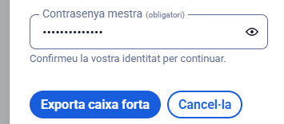

# Guia d'Ús Tècnica: Bitwarden
## Manual Operatiu per a l'Equip Tècnic d'EverPia

---

## 1. Instal·lació i Configuració Inicial

### 1.1. Registre i Creació del Compte

**Pas 1:** Entrem a la pàgina oficial de Bitwarden i seleccionem "Registrar".

**Pas 2:** Introduïm el nostre correu electrònic.

**Pas 3:** El sistema ens notificarà que hem de verificar el correu electrònic.

**Pas 4:** Creem el nostre compte introduint la contrasenya mestra.

---

## 2. Generació de Contrasenyes Segures

### 2.1. Accés al Generador de Contrasenyes

**Pas 5:** Bitwarden incorpora un generador de contrasenyes que permet crear credencials segures de forma automàtica. Pots generar contrasenyes, frases de pas o inclús noms d'usuaris.

Addicionalment té un historial de contrasenyes generades.

### 2.2. Configuració de Paràmetres de Seguretat

**Pas 6:** Recomanació d'estructura de contrasenya: Pots configurar perquè les teves contrasenyes tinguin lletres majúscules o minúscules, números o caràcters especials.

**Opcions recomanades:**
- ✅ Lletres majúscules (A-Z)
- ✅ Lletres minúscules (a-z)
- ✅ Números (0-9)
- ✅ Caràcters especials (opcional)
- **Longitud mínima:** 12-16 caràcters

---

## 3. Instal·lació de l'Extensió del Navegador

### 3.1. Descàrrega i Configuració

**Pas 7:** Instal·lem l'extensió de Bitwarden al navegador i l'obrim. Posem el nostre correu i la contrasenya que vam utilitzar en crear el compte.

---

## 4. Exemples d'Ús i Emplenament Automàtic

### 4.1. Crear un Nou Compte amb Bitwarden

**Pas 8:** Perfecte! Ara creem un compte nou utilitzant Bitwarden. Obrim l'extensió i anem a l'apartat "Generador". Pots copiar la contrasenya o generar-ne una nova tantes vegades com vulguis.

**Pas 9:** De manera automàtica, l'aplicació/extensió crearà i omplirà automàticament els credencials de connexió. Pots també posar-la en un fitxer si vols. Després clica "Guardar".

### 4.2. Ajustar la Contrasenya segons Requisits

**Pas 10:** Ooops, sembla que el nostre password no té els requisits per ser vàlid. Necessita tenir 8 caràcters (sense espais i que inclogui un número, una lletra majúscula i una minúscula).

Vés a "Generador" i marca almenys aquestes opcions:
- **A-Z** (majúscula)
- **a-z** (minúscula)
- **0-9** (números)
- **Símbols** (opcional)

### 4.3. Generador de Noms d'Usuari

**Pas 11:** Addicionalment, Bitwarden ofereix un generador d'usuari. Es troba al mateix lloc (el generador) que la contrasenya (un sub-apartat). En aquest cas he triat aquesta opció.

---

## 5. Gestió de Credencials a la Caixa Forta

### 5.1. Editar i Eliminar Credencials

**Pas 12:** Després, a la "Caixa Forta", cliques sobre la icona del lloc web/aplicació. Estaràs a l'espai dels teus credencials d'aquella aplicació/web. Cliques sobre la icona de la paperera per eliminar de manera ràpida o també pots modificar-la.

---

## 6. Funció d'Emplenament Automàtic (Auto-Fill)

### 6.1. Activar Auto-Fill

**Pas 13:** Una nota important: en Bitwarden pots utilitzar la funció "Auto-Fill", que et permet de forma automàtica omplir dades de credencials. Cliques sobre els tres punts i la funció apareixerà.

**Pas 14:** Poses de nou un altre contrasenya:

Ara el tenim:

---

## 7. Gestió de Còpies de Seguretat (Backup)

### 7.1. Exportar la Caixa Forta

És fonamental realitzar còpies de seguretat periòdiques de les nostres contrasenyes.

**Pas 1:** Hi ha la funció d'exportar les contrasenyes. Anem a "Configuració".

**Pas 2:** Anem a "Opcions de la caixa forta".

**Pas 3:** Exporta caixa forta. Pots triar exportar en format **.json** o **.csv**.

**Pas 4:** Et demanarà la teva contrasenya mestra per confirmar l'operació.

**Pas 5:** Ja el tens. El fitxer quedarà desat al nostre dispositiu.

---

## 8. Bones Pràctiques per a Còpies de Seguretat

### 8.1. Recomanacions de Seguretat

 **Freqüència de còpies:**
- Fes una còpia nova cada 3-6 mesos
- Esborra les còpies antigues després de verificar les noves

 **Emmagatzematge segur:**
- **Opció 1:** Clau USB xifrada (recomanat per a màxima seguretat)
- **Opció 2:** Servei de núvol amb xifratge (Nextcloud, Tresorit, etc.)
- **MAI guardar còpies sense xifrar en ubicacions accessibles**

 **Verificació:**
- Comprova que el fitxer s'obre correctament abans de tancar la sessió
- Assegura't que les dades exportades són completes i llegibles

⚠️ **IMPORTANT:** Les còpies de seguretat contenen totes les contrasenyes. Mantingues-les sempre protegides.

---

## Resum de Funcions Principals

| Funció | Descripció |
|--------|------------|
| **Generador de contrasenyes** | Crea contrasenyes segures i úniques automàticament |
| **Generador de noms d'usuari** | Genera noms d'usuari aleatoris |
| **Auto-Fill** | Emplena automàticament els camps de credencials |
| **Caixa Forta** | Emmagatzema i organitza totes les credencials |
| **Sincronització** | Manté les contrasenyes actualitzades en tots els dispositius |
| **Exportació** | Permet fer còpies de seguretat en format .json o .csv |

---

## Suport i Recursos Addicionals

-  [Documentació oficial de Bitwarden](https://bitwarden.com/help/)
-  [Configurar 2FA (Autenticació de Doble Factor)](https://bitwarden.com/help/setup-two-step-login/)
