# GUIA DE DUPLICATI A SISTEMES OPERATIUS

## Configuració Inicial del Disc

Instal·lem un disc dur de 10 GB:

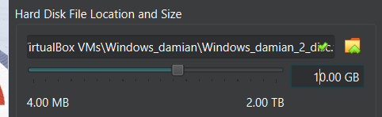

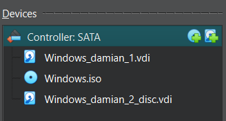

Inicialitzem el disc:

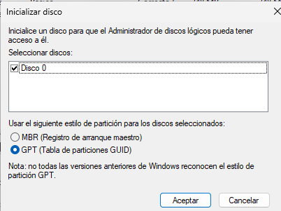

Amb clic dret creem un nou volum: 

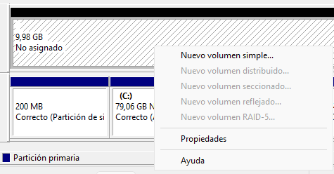

Utilitzem tot el volum: 

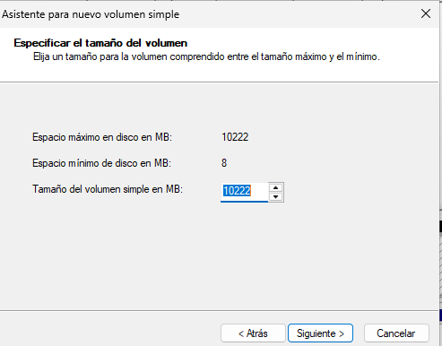

Assignem la lletra E (pot ser qualsevol):

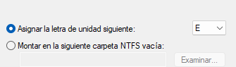

Format NTFS:

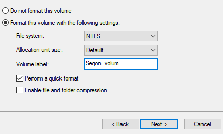

## Instal·lació de Duplicati

Instal·lem:

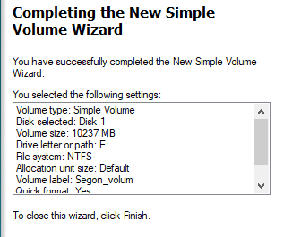

Escrivim això o obrim l'aplicació:

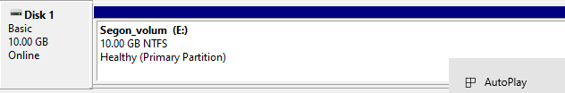

Ens demana una frase de contrasenya:

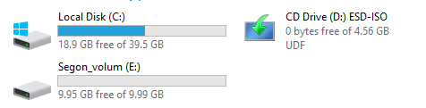

I estem, ara en el block de "backups" fes clic a sobre l'icona "Add+": i cliquem a "afegir una nova còpia de seguretat".

## Sub-Part: Creant un Backup Local

Posem el nom i la descripció per el nostre còpia de seguretat:

Per la destinació seleccionem el sistema de fitxers > segon disc:

Per l'origen posem C:/Users/Nom_d'usuari:

Per l'horari posem a true; automàticament fer còpies de seguretat, pròxima hora qualsevol, tornar a fer cada 1 hores i per últim cada dia.

Per l'últim pas ho deixem per defecte.

**Nota important:** Les còpies de seguretat estan xifrades amb una contrasenya que s'ha establert a Duplicati, tant per al backup local com per al backup en el núvol, sense requerir configuracions avançades addicionals.

## Sub-Part: Creant un Backup Cloud

Des de l'inici, afegirem una nova còpia de seguretat:

**Nota important:** Tenir una imatge ja pujat a /Documents per fer el pas de restauració.

Posem nom i frase de contrasenya per la còpia de seguretat:

Ara a la destinació per la còpia de seguretat busquem "Google Drive", cliquem al enllaç AuthID per deixar Duplicati accedir credencials, genererà un codi perquè pugui autoritzar a la nostra carpeta. Al camí de carpeta podem escriure un nom i el Duplicati ens en creara un de nou per nosaltres.

**Nota important:** Els fitxers de prova s'han creat prèviament a la carpeta Documents de l'usuari. Duplicati s'encarrega automàticament de pujar-los a Google Drive durant l'execució del backup, sense necessitat de copiar-los manualment al núvol.

Per l'origen posem el nostre usuari on hi haurà els documents:

L'horari; el pròxim hora serà a les 18:00h:

Ara tenim les dues còpies de seguretat:

Part de Local:

Part de Google Drive:

## Prova de Restauració

### Sub-Part: Restauració Local

Per fer la prova de restauració primer pujem imatges a /Documents, executem la còpia de seguretat i els eliminem:

Per assegurar que els hem eliminat anem a la papelera per eliminar-ho:

A RESTAURACIÓ LOCAL:

Fem seleccionem el fitxer que volem eliminar:

Posem a sobreescriure el fitxer i a la ubicació original:

Comprovem:

### Sub-Part: Restauració Cloud

Per fer la prova de restauració, les imatges que estan en el document, els hem de eliminar també des de la paperera:

A RESTAURACIÓ CLOUD:

Seleccionem quines carpetes volem restaurar:

Per la pas final podem seleccionar que rastauri en els fitxers previs i si volem sobreescriure o no.

Verifiquem:

## PART LINUX

L'apartat de Linux:

Verifiquem el 2n disc:

Creem una nova partició del tot:

El formatajem en .xfs:

Creem el punt de muntatge:

El montem:

Verifiquem:

Fem muntatge:

Afegim usuaris:

Creem 4 fitxers, cadascun de 10MB:

Verifiquem:

Generem contrasenya:

Fem una còpia de seguretat del /home a media backup:

Part de contrasenya:

Resultat final:

Comprovem l'estat de les còpies:

Esborrem l'arxiu:

Restaurem:

Verifiquem:

Creem un nou arxiu:

Fem una còpia incremental:

Comprovem:

Ara el desmontem:

Creem bashcript:

Fem això:

Fem `sudo crontab -e` i afegim aquesta línea:

Que és bàsicament; diumenge a les 23h, minut 0, * qualsevol dia al mes, * qualsevol mes, 0 cada diumenge. Al /usr/local/bin/fullbackup.sh executem el script. >> var/log/fullbackup.log 2>&1 es guarda la sortida en aquell log per el final 2>&1 es guarda també els errors de log.

Comprovem:

Donem permisos:

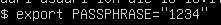

Provem:

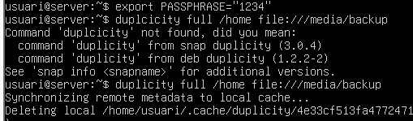

Afegim aquesta línea a l'arxiu:

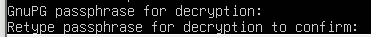

Verifiquem:

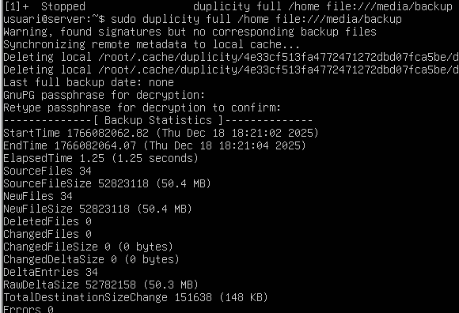

La part " 0 23 * * 1-6 " = De dilluns (1) a dissabte (6) a les 23:00

La resta és igual (no canvia)

---

**Fi**
