# Guia Linux + Windows — Gestió Flexible de Discos  
## T03 – LVM (Linux) i Storage Spaces (Windows)

Aquesta guia explica, pas a pas, com realitzar la gestió flexible d’emmagatzematge en dos sistemes operatius:

- **Linux (LVM – Logical Volume Manager)**
- **Windows (Storage Spaces / Espais d’emmagatzematge)**

Inclou totes les imatges de l’activitat, enumerades del 01 al 61, i amb una breu explicació per a cada captura.

---

# 🐧 PART 1 — LINUX: LVM (Logical Volume Manager)

---

## 1. Configuració inicial de discos


> Creació de la màquina virtual i entorn inicial.


> Afegim dos discos virtuals nous de 10GB.


> Vista dels discos creats en el panell de configuració.


> Confirmació que els discos extra han estat afegits correctament.


> Sortida de `fdisk -l` mostrant *sdb* i *sdc* com a discos nous.

---

## 2. Creació de PV, VG i LV


> Creació dels volums físics (`pvcreate`) i del grup de volums (`vgcreate volgrup /dev/sdb /dev/sdc`).

---

## 3. Creació del volum lògic

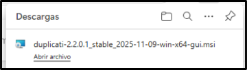

> Creació del LV `lvCB01` amb 200MiB dins del grup `volgrup`.

---

## 4. Formatació, muntatge i configuració de fstab


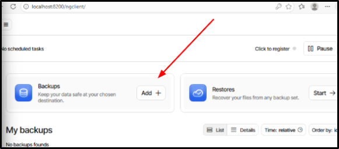
> Creem la carpeta de muntatge `/mnt/lvm_dades`.

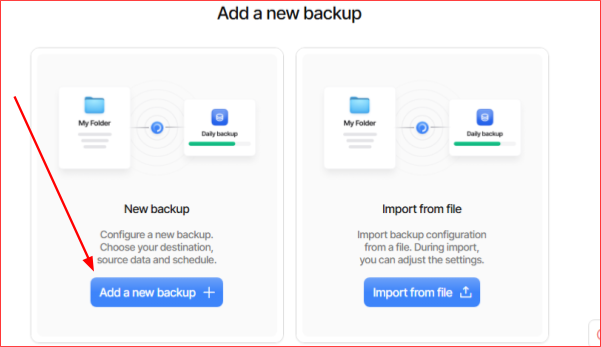
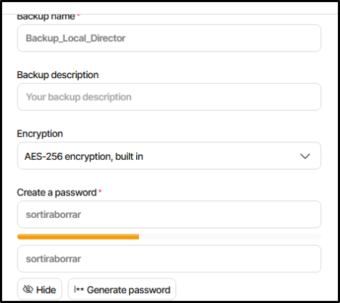
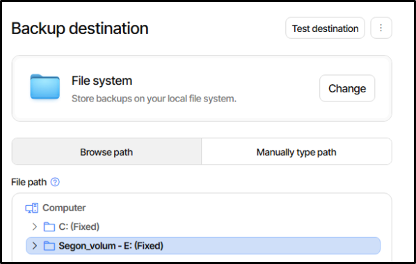
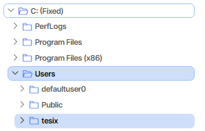
> Formatació en ext4, muntatge i afegit al fitxer `/etc/fstab` per muntatge automàtic.

---

## 5. Alta disponibilitat — Mirroring


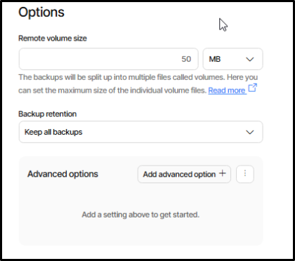

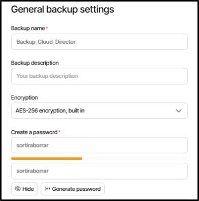
> Eliminem configuració anterior: desmuntar, esborrar LV i VG.

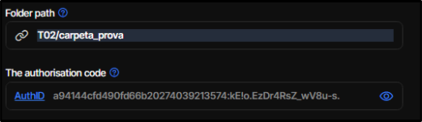
> Creació del nou VG `lvm_mirror` i volum amb mirroring:  
> `lvcreate -L 200M -m1 -n mirrorlv lvm_mirror`

---

## 6. Instantànies (Snapshots)


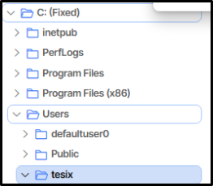
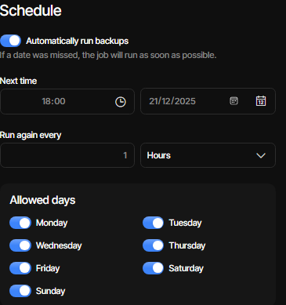
> Creació del volum origen (`origin`) i formatació.

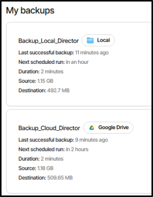
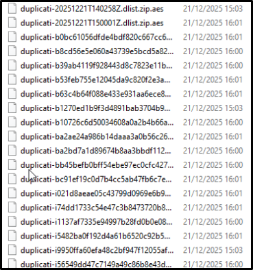
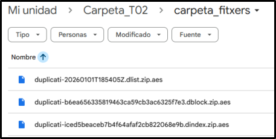
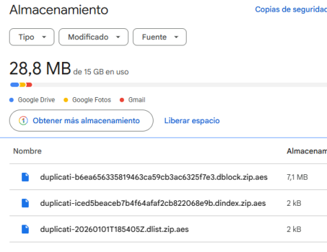

> Creació de la snapshot `lv_snapshot` a partir del volum `origin`.

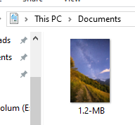
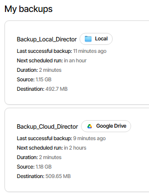

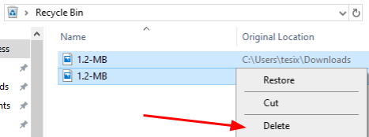
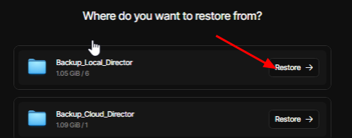
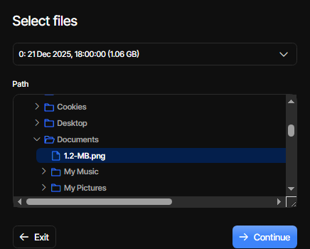
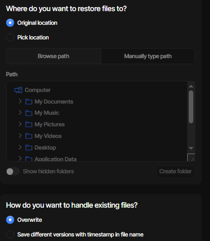
> Restauració de la snapshot i verificació de l’estat original.

---

## 7. Escalabilitat — Ampliació i Reducció de LVs

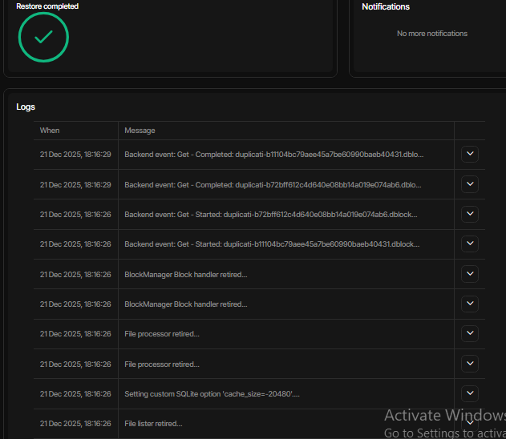
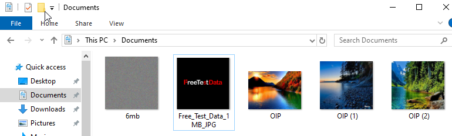
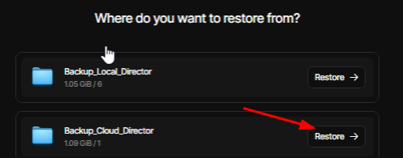
> Ús de `lvextend`, `lvreduce`, `resize2fs` i `e2fsck` per gestionar l’espai del volum.

---

# 🪟 PART 2 — WINDOWS: Storage Spaces

---

## 8. Creació de discos i Storage Pool

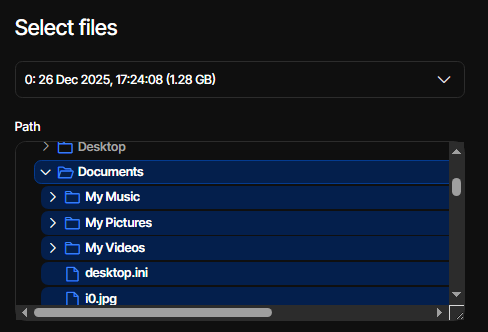

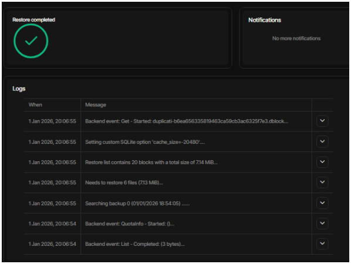
> Afegim tres discos virtuals de 10GB a la màquina Windows.

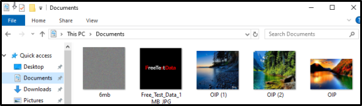
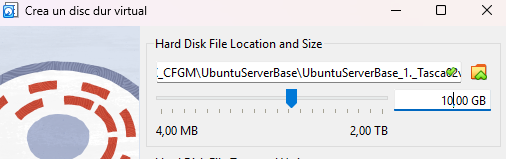
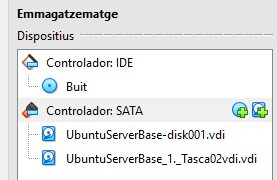
> Creació del *Storage Pool* inicial.

---

## 9. Mirroring — "Dades_Miralls"

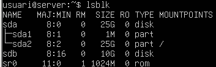
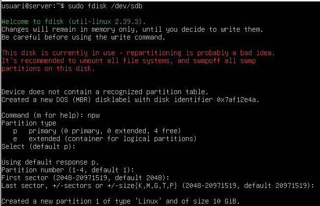
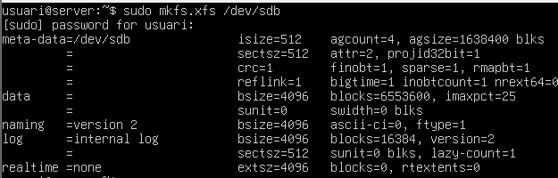
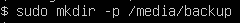
> Creació del volum amb resiliència tipus mirall (doble còpia) i prova d'eliminació d’un disc.

---

## 10. Paritat — "Dades_Paritat"

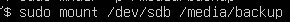
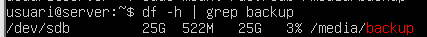
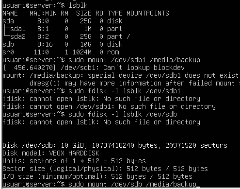
> Creació del volum amb resiliència de paritat: més capacitat útil que el mirall.

---

## 11. Triple Mirall — "Dades_TripleMirall"

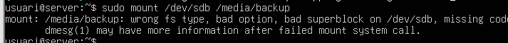
> Afegim dos discos addicionals i els inicialitzem.

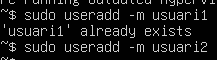
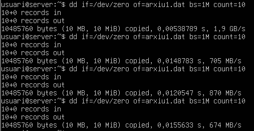
> Creació del volum amb *triple mirall*, tolerància a fallada de 2 discos.

---

## 12. Consulta d’estat amb PowerShell

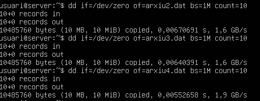
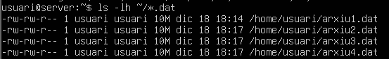

> Comandes utilitzades:
> ```powershell
> Get-StoragePool
> Get-VirtualDisk
> ```
> Mostra l’estat del pool i dels discos virtuals.

---

# 🔍 Comparació Final: Linux vs Windows

| Característica           | Linux (LVM) | Windows (Storage Spaces) |
|--------------------------|-------------|---------------------------|
| Snapshots                | ✔ Sí        | ✖ No                      |
| Mirroring                | ✔ Sí        | ✔ Sí                      |
| Paritat                  | ✔ RAID      | ✔ Natiu                   |
| Triple Mirall            | ✖ No        | ✔ Sí                      |
| Ampliació/Reeduccció     | ✔ Potent    | ✔ Però limitada           |
| CLI                      | Molt completa | Moderada (PowerShell)    |
| GUI                      | No integrada | ✔ Sí                      |
| Complexitat              | Alta         | Baixa                     |
| Flexibilitat             | Molt alta    | Mitjana                   |

---

# 📝 Conclusions

Aquesta pràctica ha permès entendre dues aproximacions molt diferents a la gestió flexible d’emmagatzematge:

- **Linux LVM** destaca per potència, flexibilitat i funcionalitats avançades com les snapshots.
- **Windows Storage Spaces** destaca per simplicitat, automatització i les diferents opcions de mirroring (incloent triple mirall).

Ambdós sistemes permeten construir entorns replicats, escalables i tolerants a fallades, cadascun amb les seves fortaleses.

---

**Fi del document.**
