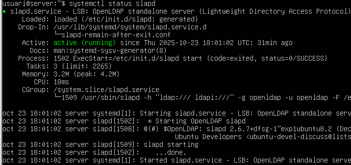

# LDAP Configuration Guide

This guide walks through the complete process of configuring an LDAP server and client setup.

## Server Configuration

### 1. Check SLDAP Status

*Verify the SLDAP service is running correctly*

### 2. Verify Directory Creation

*Confirm the LDAP directory structure has been created as intended*

### 3. Reconfigure SLDAP

*Execute the reconfiguration command: `dpkg-reconfigure sldap`*

### 4. Configuration Wizard - Step 1

*Select "No" at the initial prompt*

### 5. Set Domain Name

*Enter the domain: `innovatech28.test`*

### 6. Organization Name

*Set organization name: `inovatechxx` (where xx is your list number)*

### 7. Administrator Password

*Set the administrator password (usuari)*

### 8. Confirmation Prompts

*Confirm with "Yes" for both prompts*

### 9. Verify Directory Structure

*Confirm the directory has been properly created*

## Creating LDIF Files

### 10. Create First File

*Create the initial LDIF configuration file*

### 11. File Modifications

*Add the necessary modifications to the LDIF file*

### 12. Add Elements Command

*Use ldapadd command to insert elements into the directory*

### 13. Add Entry

*Add the new entry to the LDAP directory*

### 14. Search Verification

*Search the directory to verify the entry was added*

### 15. Attribute Search

*Search for specific attributes in LDAP*

### 16. Execute Search Command

*Run the search command to retrieve data*

## LDAP Account Manager Setup

### 17. Install Account Manager

*Install LDAP Account Manager package*

### 18. Open LAM Interface

*Access LDAP Account Manager web interface and edit server profiles*

### 19. Server Profile Password

*Enter the LAM configuration password: `lam`*

### 20. Account Type Configuration

*Configure active account types (users/groups)*

## Creating Groups

### 21. Create Group

*Create a new group in LDAP*

### 22. Save and Return

*Save the group configuration and return to main menu*

### 23. Tech Group

*Configure the tech group*

### 24. Groups List

*View complete list of created groups*

## Creating Users

### 25. New Users Section

*Navigate to "New Users" section and fill in personal credentials*

### 26. Unix Password Header

*Near the password header, check the Unix header and save*

### 27. Unix Section Configuration

*Configure and save Unix section settings*

### 28. Create Manager User

*Create a manager user account*

### 29. Manager Unix Settings

*Configure Unix settings for manager account*

### 30. Set Manager Password

*Set password for manager and save*

### 31. Users List

*View complete list of created users*

## Client Configuration (Zorin OS)

### 32. Edit Hosts File

*On the client (ZORIN), edit `/etc/hosts` file*

### 33. Verification Command

*Run command to verify connectivity*

### 34. Additional Command

*Execute additional verification command*

### 35. Server Name Configuration

*Fill in the missing parts with your server name*

### 36. Further Modifications

*Make additional configuration modifications*

### 37. Verification Check

*Verify all configuration settings*

### 38. Configure Client File

*Configure the client configuration file*

### 39. Remove use_autho Line

*Edit the file and remove the `use_autho` line*

### 40. Perfect Configuration

*Configuration completed successfully*

### 41. Restart Service

*Restart the LDAP service*

### 42. Reinitialize Service

*Reinitialize the service*

### 43. Check Clients

*Verify that clients are properly connected*

## Summary

This guide covers:
- LDAP server installation and configuration
- Directory structure creation
- LDIF file management
- LDAP Account Manager setup
- Group and user creation
- Client configuration on Zorin OS
- Service verification and troubleshooting

All configuration files and commands are executed with appropriate permissions and verified at each step.
