# Guia de Configuració LDAP

Aquesta guia explica el procés complet de configuració d'un servidor LDAP i la configuració del client.

## Configuració del Servidor

### 1. Mirar l'estat del sldap

*Verificar que el servei SLDAP s'està executant correctament*

### 2. Comprovar que el directori s'ha creat com hem volgut
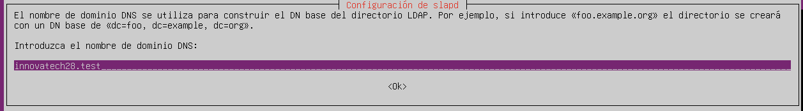
*Confirmar que l'estructura del directori LDAP s'ha creat correctament*

### 3. Fer la comanda: nano dpkg-reconfigure sldap
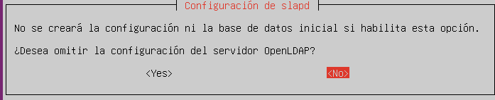
*Executar la comanda de reconfiguració: `dpkg-reconfigure sldap`*

### 4. Cliquem no

*Seleccionar "No" a la pregunta inicial*

### 5. Posem aquesta (innovatech28.test)
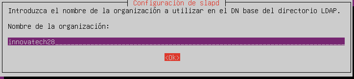
*Introduir el domini: `innovatech28.test`*

### 6. Posem inovatechxx (xx és num llista)
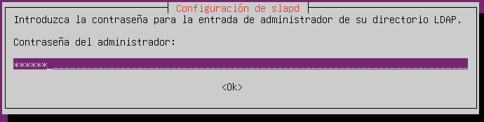
*Establir el nom de l'organització: `inovatechxx` (on xx és el teu número de llista)*

### 7. Posem la contrasenya (usuari)
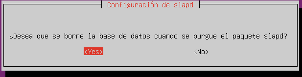
*Establir la contrasenya de l'administrador (usuari)*

### 8. Posem que si
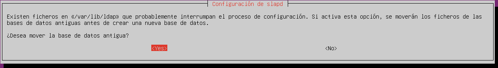
*Confirmar amb "Sí"*

### 9. Posem que si
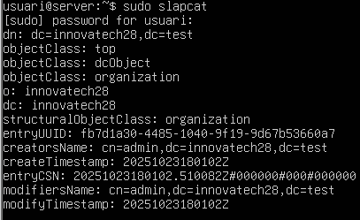
*Confirmar amb "Sí" novament*

### 10. Comprovar que el directori s'ha creat com hem volgut
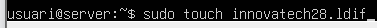
*Confirmar que el directori s'ha creat correctament*

## Creació de fitxers LDIF

### 11. Primer creem fitxer
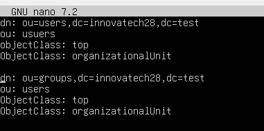
*Crear el fitxer de configuració LDIF inicial*

### 12. Posem aquestes modificacions
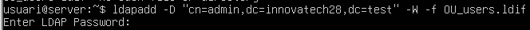
*Afegir les modificacions necessàries al fitxer LDIF*

### 13. Aquesta comanda permet afegir elements al directori
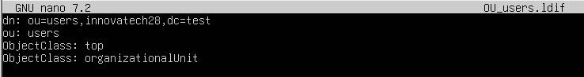
*Utilitzar la comanda ldapadd per inserir elements al directori*

### 14. Posem
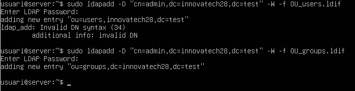
*Introduir les dades necessàries*

### 15. Afegim aquesta entrada
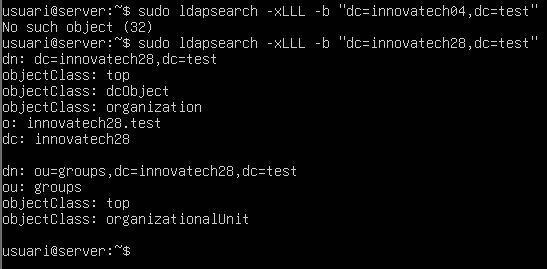
*Afegir la nova entrada al directori LDAP*

### 16. El busquem per assegurar
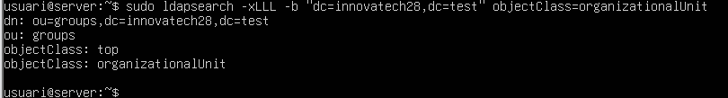
*Cercar per assegurar que l'entrada s'ha afegit correctament*

### 17. Fem ldap search al atribut
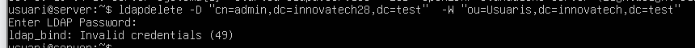
*Fer una cerca LDAP a l'atribut específic*

### 18. Fem aquesta comanda

*Executar la comanda de cerca*

## Configuració de LDAP Account Manager

### 19. Instal·lem account manager
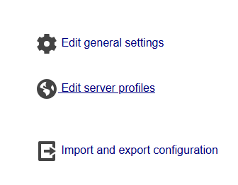
*Instal·lar el paquet LDAP Account Manager*

### 20. Obrim el LDAP account manager; editar perfils de servidor > posar contrasenya (lam)
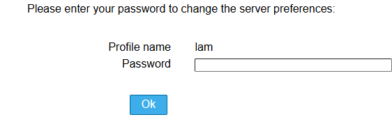
*Accedir a la interfície web de LDAP Account Manager, editar perfils de servidor i introduir la contrasenya: `lam`*

### 21. Posem aquestes modificacions en el part de tipus de comptes actius (usuaris/grups)
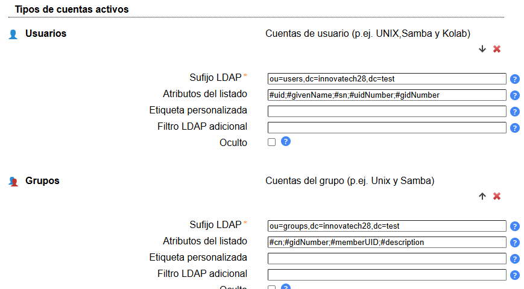
*Configurar els tipus de comptes actius (usuaris/grups)*

## Creació de Grups

### 22. Creem un grup
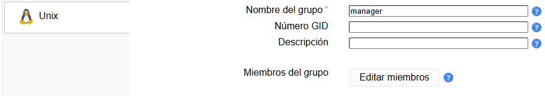
*Crear un nou grup a LDAP*

### 23. Guardem i regresem

*Guardar la configuració del grup i tornar al menú principal*

### 24. Ara per tech
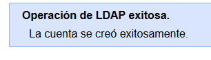
*Configurar el grup tech*

### 25. Això és la llista de grups
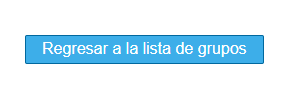
*Veure la llista completa de grups creats*

## Creació d'Usuaris

### 26. Anem a "nous usuaris" secció personal, i omplim credencials
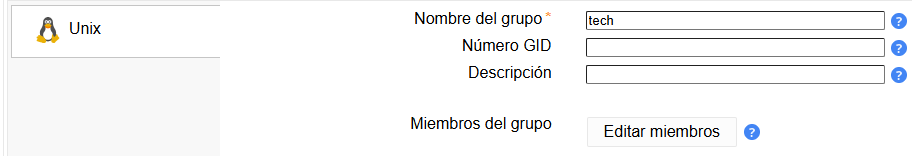
*Navegar a la secció "Nous usuaris", apartat personal, i omplir les credencials*

### 27. Apropde la capçalera "contrasenya", i marquem la capçalera Unix i el guardem

*Prop de la capçalera "contrasenya", marcar la capçalera Unix i guardar*

### 28. Ara anem a l'apartat Unix i el guardem
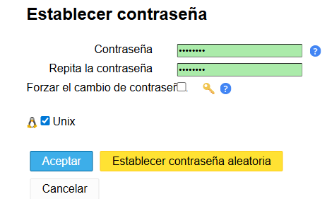
*Anar a l'apartat Unix i guardar*

### 29. Ara creem manager
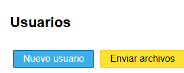
*Crear un compte d'usuari manager*

### 30. Al Unix
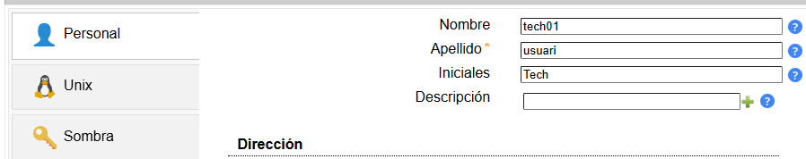
*Configurar les opcions Unix per al manager*

### 31. Establim contrasenya i el guardem

*Establir la contrasenya per al manager i guardar*

### 32. Aquí podem veure la llista d'usuaris
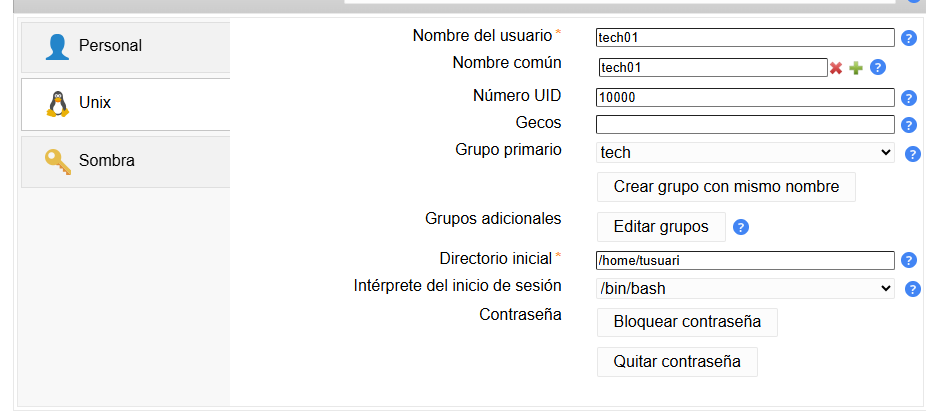
*Veure la llista completa d'usuaris creats*

## Configuració del Client (ZORIN)

### 33. Ara al part client (ZORIN) editem el fitxer "/etc/hosts"
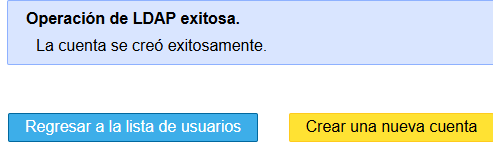
*Al client (ZORIN), editar el fitxer `/etc/hosts`*

### 34. Fem aquesta comanda per comprovar
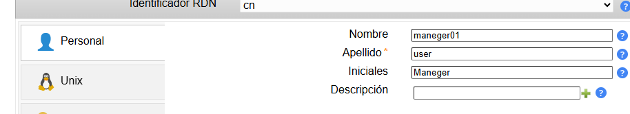
*Executar comanda per comprovar la configuració*

### 35. Fem aquesta comanda
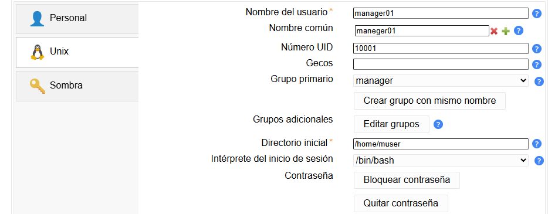
*Executar aquesta comanda*

### 36. Omplim el part que falta amb la nostra nom de server
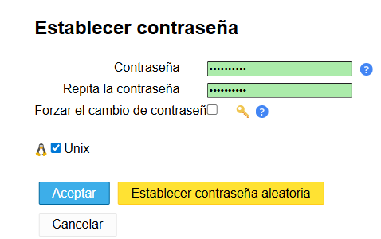
*Omplir les parts que falten amb el nom del teu servidor*

### 37. Fem més modificacions…
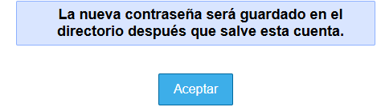
*Fer modificacions de configuració addicionals*

### 38. Comprovem
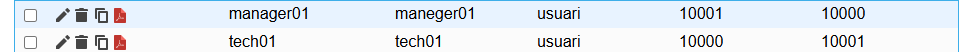
*Comprovar la configuració*

### 39. Al part de client configurem el arxiu
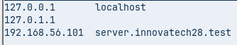
*Configurar l'arxiu del client*

### 40. Editem l'arxiu i eliminem la línea use_autho
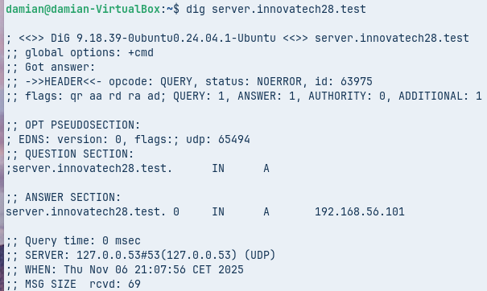
*Editar l'arxiu i eliminar la línia `use_autho`*

### 41. Perfecte

*Configuració completada correctament*

### 42. Fem un restart del servei
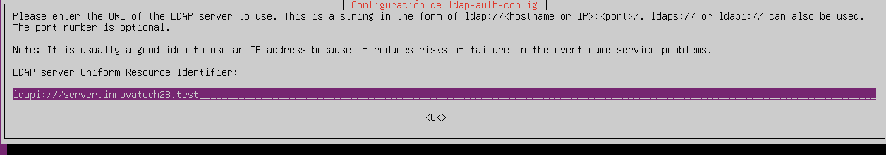
*Fer un restart del servei LDAP*

### 43. El reiniciem
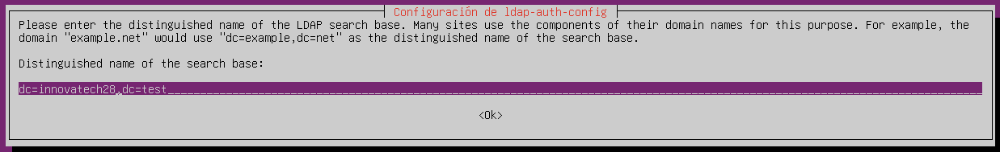
*Reiniciar el servei*

### 44. Mirem si tenim els clients
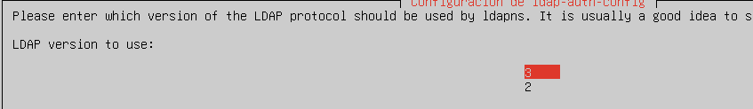
*Verificar que els clients estan connectats correctament*

## Resum

Aquesta guia cobreix:
- Instal·lació i configuració del servidor LDAP
- Creació de l'estructura de directoris
- Gestió de fitxers LDIF
- Configuració de LDAP Account Manager
- Creació de grups i usuaris
- Configuració del client a Zorin OS
- Verificació del servei i resolució de problemes

Tots els fitxers de configuració i comandes s'executen amb els permisos adequats i es verifiquen a cada pas.
### 45. Configuració PAM per autenticació LDAP
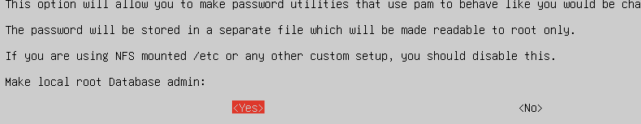
*Configuració PAM per autenticació LDAP*

### 46. Edició de fitxer nsswitch.conf
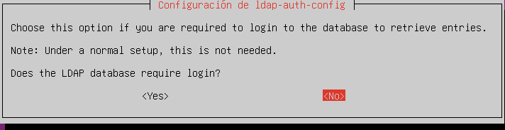
*Edició de fitxer nsswitch.conf*

### 47. Configuració del mòdul PAM
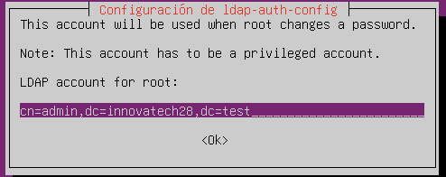
*Configuració del mòdul PAM*

### 48. Afegir línies a pam.d/common-auth
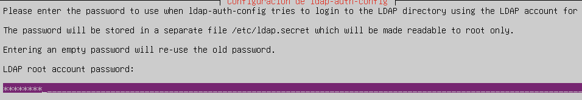
*Afegir línies a pam.d/common-auth*

### 49. Afegir línies a pam.d/common-account
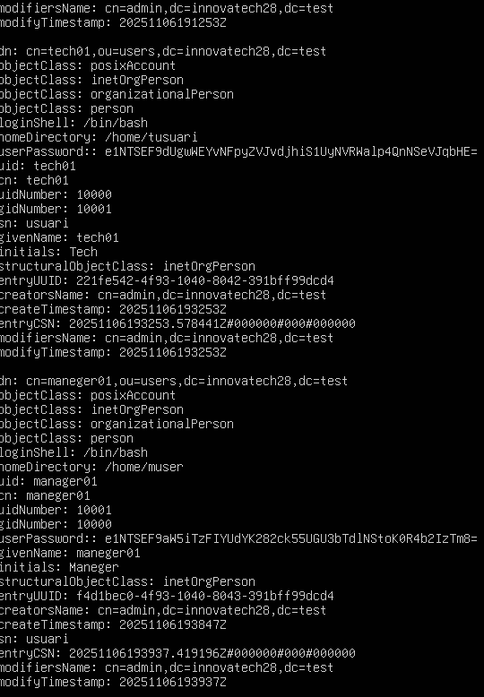
*Afegir línies a pam.d/common-account*

### 50. Afegir línies a pam.d/common-password
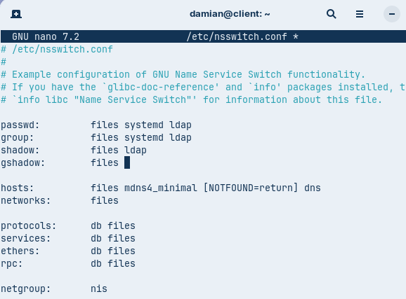
*Afegir línies a pam.d/common-password*

### 51. Afegir línies a pam.d/common-session

*Afegir línies a pam.d/common-session*

### 52. Comprovació de configuració PAM
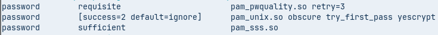
*Comprovació de configuració PAM*

### 53. Reiniciar serveis LDAP i PAM
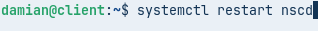
*Reiniciar serveis LDAP i PAM*

### 54. Verificació final amb comandes ldapsearch

*Verificació final amb comandes ldapsearch*

### 55. Llista final d'usuaris i grups LDAP
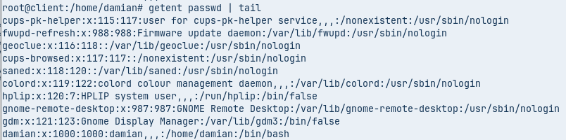
*Llista final d'usuaris i grups LDAP*
