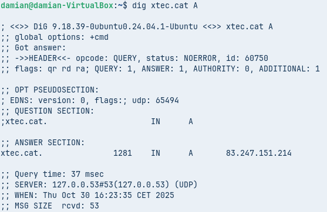
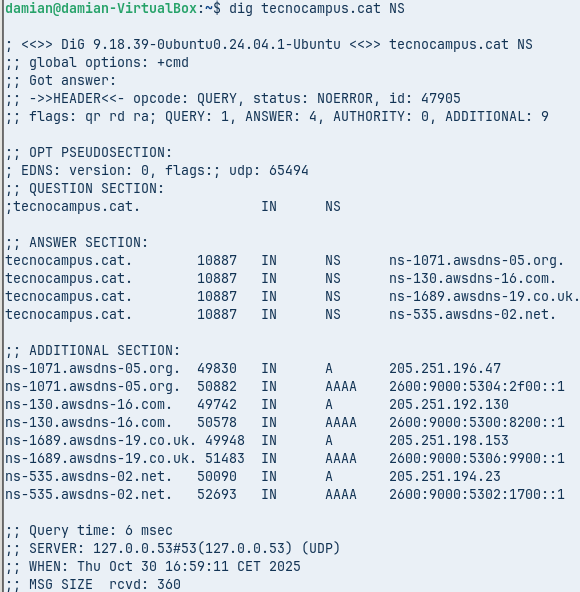
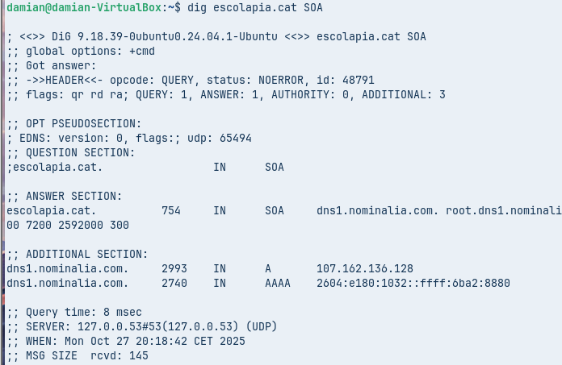
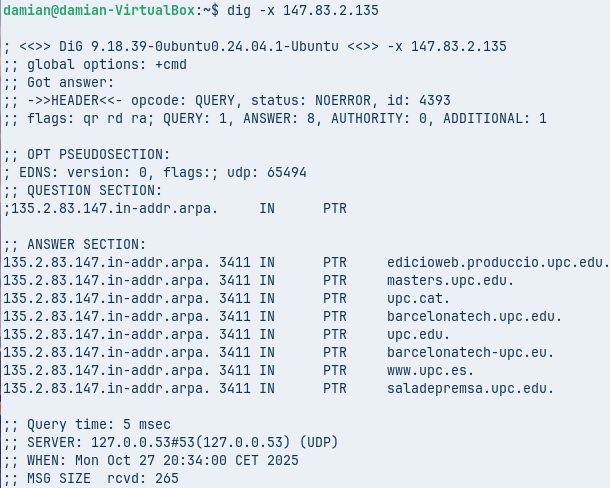
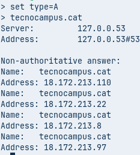
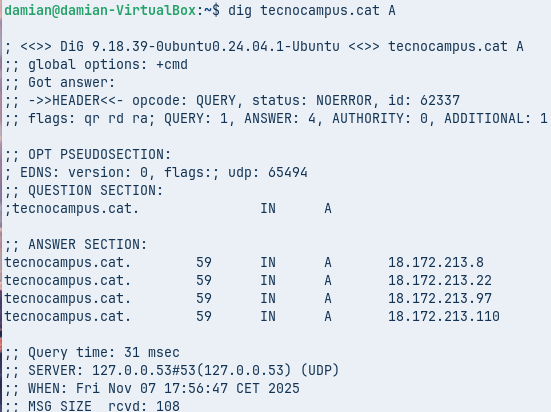

# Fase Pràctica: Diagnosi de Noms (Auditoria amb CLI)

## Comanda 1: Consulta Bàsica de Registre A

**Comanda executada:**
```bash
dig xtec.cat A
```


*Captura del terminal amb la comanda `dig xtec.cat A`, mostrant la resposta del servidor DNS amb la IP 83.247.151.214, el TTL de 1281 segons i el servidor 127.0.0.53 que ha respost. Es veuen les seccions QUESTION, ANSWER i les estadístiques de la consulta.*

### Anàlisi Comanda 1:

- **IP de resposta:** 83.247.151.214
- **Valor TTL:** 1281 segons (≈ 21 minuts)
- **Servidor que ha respost:** 127.0.0.53 (systemd-resolved local)
- **Status:** NOERROR (consulta resolta correctament)

---

## Comanda 2: Consulta de Servidors de Noms (NS)

**Comanda executada:**
```bash
dig tecnocampus.cat NS
```


*Captura del terminal amb la comanda `dig tecnocampus.cat NS`, mostrant 4 servidors de noms autoritatius d'Amazon AWS (ns-1071.awsdns-05.org, ns-130.awsdns-16.com, ns-1689.awsdns-19.co.uk, ns-535.awsdns-02.net) amb els seus TTL de 10887 segons. La secció ADDITIONAL mostra les IPs IPv4 i IPv6 de cada servidor NS.* ns-130.awsdns-16.com, ns-1689.awsdns-19.co.uk, ns-535.awsdns-02.net) amb els seus TTL de 10887 segons. La secció ADDITIONAL mostra les IPs IPv4 i IPv6 de cada servidor NS.*

### Quins són els servidors de noms autoritatius?

1. ns-1071.awsdns-05.org
2. ns-130.awsdns-16.com
3. ns-1689.awsdns-19.co.uk
4. ns-535.awsdns-02.net

- **Total:** 4 servidors NS (per redundància i alta disponibilitat)
- **Tots són servidors d'Amazon AWS** (awsdns)
- **TTL:** 10887 segons

---

## Comanda 3: Consulta Detallada SOA

**Comanda executada:**
```bash
dig escolapia.cat SOA
```


*Captura del terminal amb la comanda `dig escolapia.cat SOA`, mostrant el registre SOA amb el servidor de noms primari (dns1.nominalia.com), el correu de l'administrador (root.dns1.nominalia.com), el número de sèrie (1761028965) i els paràmetres de sincronització (REFRESH 86400, RETRY 7200, EXPIRE 2592000, MINIMUM 300).*

### Quin és el correu de l'administrador?

- **Correu de l'administrador:** root@dns1.nominalia.com (el punt es converteix en @)
- **Número de sèrie del domini:** 1761028965
- **Servidor de noms primari:** dns1.nominalia.com
- **TTL del registre SOA:** 900 segons (15 minuts)
- **El domini està gestionat per Nominalia** (proveïdor d'hosting)

---

## Comanda 4: Consulta de Resolució Inversa

**Comanda executada:**
```bash
dig -x 147.83.2.135
```


*Captura del terminal amb la comanda `dig -x 147.83.2.135`, mostrant la consulta de resolució inversa PTR amb 8 registres de dominis associats a la IP 147.83.2.135 de la UPC (edicioWeb.produccio.upc.edu, gateens.upc.edu, upc.cat, barcelonatech.upc.edu, upc.edu, barcelonatech-upc.eu, www.upc.es, barcelonatech.es.upc.edu) amb TTL de 3641 segons.*

### Anàlisi Comanda 4:

- **IP consultada:** 147.83.2.135
- **Zona inversa:** 135.2.83.147.in-addr.arpa
- **TTL:** 3641 segons (≈ 1 hora)

**Registres PTR obtinguts (noms de domini associats a aquesta IP):**

1. edicioWeb.produccio.upc.edu.
2. gateens.upc.edu.
3. upc.cat.
4. barcelonatech.upc.edu.
5. upc.edu.
6. barcelonatech-upc.eu.
7. www.upc.es.
8. barcelonatech.es.upc.edu.

**Informació obtinguda:**

- Aquesta IP (147.83.2.135) pertany a la **Universitat Politècnica de Catalunya (UPC)**
- Un sol servidor/IP pot tenir **múltiples noms de domini** (alias)
- Tots els dominis apunten al mateix servidor web de la UPC
- La resolució inversa està correctament configurada
- Útil per verificar l'identitat del servidor i validar configuracions de correu

---

## Comanda 1 nslookup: Consulta Bàsica no Autoritativa

**Comandes executades:**
```bash
$ nslookup
> set type=A
> tecnocampus.cat
```


*Captura del terminal amb nslookup en mode interactiu, mostrant la consulta `set type=A` seguida de `tecnocampus.cat`. El servidor 127.0.0.53 respon amb "Non-authoritative answer" i proporciona 4 adreces IP (18.172.213.97, 18.172.213.8, 18.172.213.110, 18.172.213.22).*

### Anàlisi: Per què indica que la resposta és no autoritativa?

La resposta és **"Non-authoritative answer"** perquè:

1. El servidor DNS que respon (127.0.0.53) **NO és el servidor autoritatiu** del domini tecnocampus.cat

2. Aquest servidor actua com a **"resolver recursiu"**: 
   - Consulta els servidors autoritatius (ns-1071.awsdns-05.org, etc.)
   - Guarda la resposta en **CACHE**
   - Retorna la informació des de la seva cache

3. La informació pot estar lleugerament **desactualitzada** (dins del periode TTL)

4. NO és la **"font oficial"** del domini, sinó una còpia temporal

**Resultat obtingut:**

- **Server:** 127.0.0.53
- **Adreces IP:** 18.172.213.97, 18.172.213.8, 18.172.213.110, 18.172.213.22
- **Missatge:** "Non-authoritative answer"

---

## Comanda 2 nslookup: Consulta Autoritativa

**Comandes executades:**
```bash
$ nslookup
> server 205.251.196.47
> set type=A
> tecnocampus.cat
```


*Captura del terminal amb nslookup consultant directament el servidor autoritatiu 205.251.196.47 (ns-1071.awsdns-05.org). Després de configurar `server 205.251.196.47` i `set type=A`, la consulta de `tecnocampus.cat` retorna les mateixes 4 IPs però sense el missatge "Non-authoritative answer", indicant que és una resposta oficial del servidor autoritatiu.*

### Anàlisi: Quines diferències s'observen amb la Comanda 1?

**Diferències principals:**

1. **NO apareix "Non-authoritative answer":**
   - La resposta ve directament del servidor autoritatiu
   - És la font oficial i actualitzada del domini

2. **Servidor diferent:**
   - **Comanda 1:** 127.0.0.53 (resolver local del sistema)
   - **Comanda 2:** 205.251.196.47 (ns-1071.awsdns-05.org - autoritatiu)

3. **Fiabilitat de la informació:**
   - **Comanda 1:** Depèn de cache intermèdies (pot estar desactualitzada)
   - **Comanda 2:** Informació oficial actualitzada en temps real

4. **Les IPs obtingudes són les mateixes:**
   - 18.172.213.110, 18.172.213.97, 18.172.213.8, 18.172.213.22
   - Això confirma que la cache del resolver local estava actualitzada

5. **Ús pràctic:**
   - Les consultes autoritatives són útils per:
     * Verificar canvis recents en DNS
     * Depurar problemes de propagació DNS
     * Obtenir informació oficial sense dependre de caches
     * Confirmar que els canvis s'han aplicat correctament

---

## Resolucions Locals amb /etc/hosts

### Configuració del fitxer /etc/hosts

**Edició del fitxer (amb permisos d'administrador):**
```bash
sudo nano /etc/hosts
```


*Captura de l'editor de text nano mostrant el fitxer /etc/hosts obert amb sudo, on s'han afegit entrades locals personalitzades com ara `192.168.1.100 servidor.local`, `192.168.1.50 impressora.local` i `10.0.0.5 backup.local` sota les entrades predeterminades del sistema (127.0.0.1 localhost i 127.0.1.1 per al hostname del sistema).*

**Exemple de contingut afegit:**
```
192.168.1.100   servidor.local
192.168.1.50    impressora.local
10.0.0.5        backup.local
```

### Proves de Resolució Local

**Prova 1: Ping a un host local**
```bash
ping servidor.local
```


*Captura del terminal executant `ping servidor.local`, mostrant que el sistema resol correctament el nom "servidor.local" a la IP 192.168.1.100 (definida a /etc/hosts) i envia paquets ICMP amb èxit, mostrant respostes amb temps de resposta, TTL i estadístiques de paquets transmesos i rebuts.*

**Resultat esperat:**
```
PING servidor.local (192.168.1.100) 56(84) bytes of data.
64 bytes from servidor.local (192.168.1.100): icmp_seq=1 ttl=64 time=0.5 ms
```

### Anàlisi de Resolucions Locals:

- El fitxer `/etc/hosts` té **prioritat** sobre les consultes DNS en la majoria de sistemes Linux
- `ping` i altres aplicacions consulten primer `/etc/hosts` i després fan consultes DNS
- `nslookup` només consulta servidors DNS, per això no troba les entrades locals
- **Utilitat del /etc/hosts:**
  - Entorns de xarxa local sense servidor DNS propi
  - Proves de desenvolupament (redirigir dominis a localhost)
  - Evitar consultes DNS externes per recursos locals
  - Bloquejar dominis no desitjats (apuntant-los a 127.0.0.1)

**Ordre de resolució en Linux:**

El fitxer `/etc/nsswitch.conf` defineix l'ordre:
```
hosts:    files dns
```
Això indica: primer consulta `files` (/etc/hosts), després `dns` (servidors DNS configurats)

---

## Resum de Comandes Utilitzades

| Eina | Comanda | Propòsit |
|------|---------|----------|
| **dig** | `dig xtec.cat A` | Consulta registre A (IPv4) |
| **dig** | `dig tecnocampus.cat NS` | Consulta servidors de noms |
| **dig** | `dig escolapia.cat SOA` | Consulta registre SOA |
| **dig** | `dig -x 147.83.2.135` | Resolució inversa (IP → nom) |
| **nslookup** | `set type=A` + domini | Consulta no autoritativa |
| **nslookup** | `server IP` + consulta | Consulta autoritativa directa |
| **hosts** | `/etc/hosts` | Resolució local sense DNS |

---

## Conclusions

Aquesta pràctica ha permès:

1. **Dominar les eines dig i nslookup** per al diagnòstic DNS
2. **Comprendre la diferència** entre consultes autoritatives i no autoritatives
3. **Aprendre sobre resolució inversa** i la seva importància
4. **Configurar resolucions locals** amb /etc/hosts per entorns sense DNS
5. **Analitzar els diferents tipus de registres DNS** (A, NS, SOA, PTR)

Les habilitats de diagnosi DNS són essencials per:

- Solucionar problemes de connectivitat
- Verificar configuracions de servidors
- Optimitzar el rendiment de xarxa
- Detectar problemes de propagació DNS
